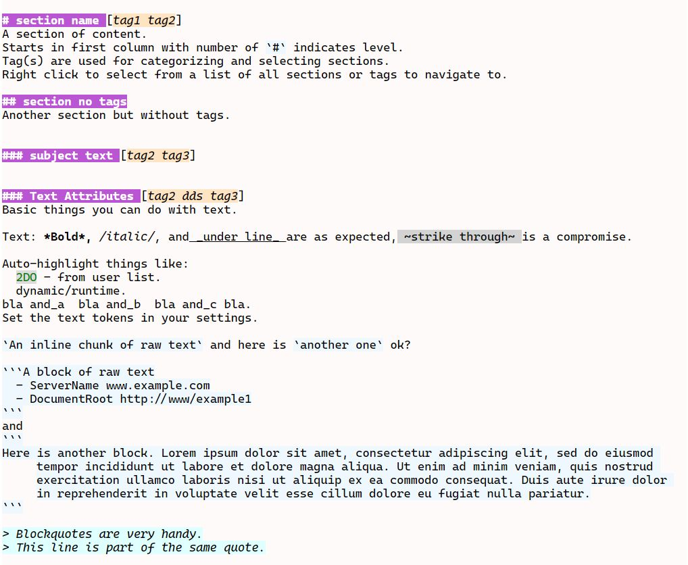
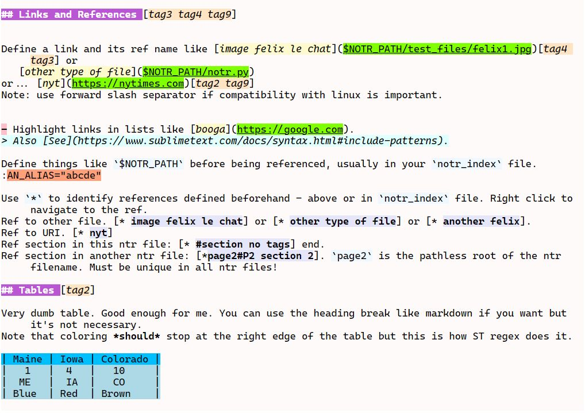

# Notr

Sublime Text plugin for managing collections of notes. Note files have the extension `.ntr` and the corresponding markup syntax
provides file and section navigation and colorizing to provide visual clues for things like sections, links, tables, lists, etc.
It is a plain text format with a lot of similarity to markdown but is not intended to be rendered into a publication - the text
itself is the whole point of this.

Built for ST4 on Windows and Linux.

## Features

- Sections with tags.
- Various text decorations.
- Targets and references - targets can be section, file (image or other), uri. Navigation to any within context of your settings.
- Lists.
- Tables - fit, sort, etc (could be ported for general purpose use). Loosely based on https://github.com/wadetb/Sublime-Text-Advanced-CSV.
- Auto highlight - supplements [SbotHighlight](https://github.com/cepthomas/SbotHighlight)
- Render to html with [SbotRender](https://github.com/cepthomas/SbotRender)

Highly recommended to install SbotHighlight and SbotRender.

## Demo

[The spec](test_files/notr-spec.ntr) provides an example of the features. If the plugin is installed it will look
something like this:





To run the demo:
- Install the plugin.
- Open `Preferences->Package Settings->Notr`.
- Edit to something like this:

``` json
{
    "notr_paths": [
        "your-path/Sublime Text/Packages/Notr/test_files",
    ],
    "notr_index": "your-path/Sublime Text/Packages/Notr/test_files/test-index.ntr",
    "fixed_hl": [
        ["2DO", "and_a"],
        ["user", "and_b"],
        ["dynamic", "and_c"],
    ],
}
```

- Implement color scheme per [Color Scheme](#color-scheme).
- Now open `test_files/notr-spec.ntr`. Test drive the various context menu selections.


## Commands

| Command                        | Type     | Description                                       | Args                                  |
| :--------                      | :-----   | :-------                                          | :--------                             |
| notr_insert_target_from_clip   | Context  | Insert a target from clipboard                    |                                       |
| notr_insert_ref                | Context  | Insert a ref from selector                        |                                       |
| notr_goto_target               | Context  | Go to a target from selector                      | filter_by_tag: true, select tag first |
| notr_follow_ref                | Context  | Go to a reference from selector                   |                                       |
| notr_insert_hrule              | Context  | Make a line                                       | fill_str: "=", reps: 20               |
| table_fit                      | Context  | Fit table contents to columns                     |                                       |
| table_insert_col               | Context  | Insert column at caret                            |                                       |
| table_delete_col               | Context  | Remove column at caret                            |                                       |
| table_sort_col                 | Context  | Sort column at caret - direction toggles          | asc: true/false                       |
| notr_dump                      | Context  | Diagnostic to show the internal info              |                                       |
| notr_reload                    | Context  | Diagnostic to force reload after editing colors   |                                       |

## Settings

| Setting             | Description                                | Options                                    |
| :--------           | :-------                                   | :------                                    |
| notr_paths          | List of where notr files live              |                                            |
| notr_index          | Main notr file                             |                                            |
| sort_tags_alpha     | Sort tags alphabetically else by frequency | true/false                                 |
| visual_line_length  | For horizontal rule                        |                                            |
| fill_str            | For horizontal rule                        |                                            |
| fixed_hl            | Three sets of user keywords                |                                            |
| fixed_hl_whole_word | User highlights option                     | true/false                                 |

## Color Scheme

Color schemes require new and edited scopes to support this tool. Implement your unique version of these in `your.sublime-color-scheme`.

``` json
{
    "rules":
    [
        // Existing scopes used by Notr.
        { "scope": "meta.link.reference", "background": "lightgreen" },
        { "scope": "meta.link.inline", "background": "lightblue" },
        { "scope": "meta.table", "background": "lightblue" },
        { "scope": "meta.table.header", "background": "deepskyblue" },
        { "scope": "markup.underline.link", "background": "yellow" },
        { "scope": "markup.italic", "font_style": "italic" },
        { "scope": "markup.bold", "font_style": "bold" },
        { "scope": "markup.underline", "font_style": "underline" },

        // Scopes added for Notr.
        { "scope": "text.notr", "foreground": "black" },
        { "scope": "markup.directive.notr", "background": "lightsalmon" },
        { "scope": "markup.underline.link.notr", "background": "chartreuse" },
        { "scope": "markup.strikethrough", "background": "lightgray" },
        { "scope": "markup.heading.content.notr", "background": "aquamarine", "font_style": "bold" },
        { "scope": "markup.heading.tags.notr", "background": "bisque", "font_style": "italic" },
        { "scope": "markup.hrule.notr", "background": "mediumaquamarine" },
        { "scope": "markup.raw.inline.notr", "background": "aliceblue" },
        { "scope": "markup.raw.block.notr", "background": "aliceblue" },
        { "scope": "markup.quote.notr", "background": "lightcyan", "font_style": "italic" },
        { "scope": "markup.list.indent.notr", "background": "snow" },
        { "scope": "markup.list.marker.notr", "background": "pink", "font_style": "bold" },
        { "scope": "markup.list.content.notr", "background": "lightyellow" },
        { "scope": "markup.link.name.notr", "background": "lemonchiffon", "font_style": "italic" },
        { "scope": "markup.link.tags.notr", "background": "bisque", "font_style": "italic" },
        { "scope": "markup.link.refname.notr", "background": "lavender", "font_style": "bold" },

        // Fixed highlighting.
        { "scope": "markup.fixed_hl1", "background": "gainsboro", "foreground": "red" },
        { "scope": "markup.fixed_hl2", "background": "gainsboro", "foreground": "green" },
        { "scope": "markup.fixed_hl3", "background": "gainsboro", "foreground": "blue" },

        // User highlighting. Only needed if you are also using SbotHighlight.
        { "scope": "markup.user_hl1", "background": "red", "foreground": "white" },
        { "scope": "markup.user_hl2", "background": "green", "foreground": "white" },
        { "scope": "markup.user_hl3", "background": "blue", "foreground": "white" },
        { "scope": "markup.user_hl4", "background": "yellow", "foreground": "black" },
        { "scope": "markup.user_hl5", "background": "lime", "foreground": "black" },
        { "scope": "markup.user_hl6", "background": "cyan", "foreground": "black" },
    ]
}
```

## Caveats

- ST regex is a custom line-oriented [engine](https://www.sublimetext.com/docs/syntax.html). Some things pertaining to normal line endings don't quite work as expected.
- Note that coloring *should* stop at the right edge of a table. This is also how ST renders MD tables. Something to do with meta-scope.
- Coloring for `markup.user_hls` and `markup.fixed_hls` only supports fore and back colors, not font_style.
- `view.add_regions()`` apparently only supports colors, annotations, and icon. It does not support font style and region flags.   Also they are not available via `extract_scope()``.
- After editing your color-scheme, close and reopen affected views.


# Future Features (maybe)
- Publish notes somewhere for access from browser/phone.
- Support projects.
- Block "comment" by inserting string from settings at bol.
- Folding by section/hierarchy. Might be [tricky](https://github.com/sublimehq/sublime_text/issues/5423).
- Insert from unicode menu at caret.
- Toggle syntax coloring (distraction free).
- Show image file thumbnail as phantom or hover. Something fun with annotations, like [popups](https://facelessuser.github.io/sublime-markdown-popups).
- Indent/dedent lists with bullets.
- Table filters.
