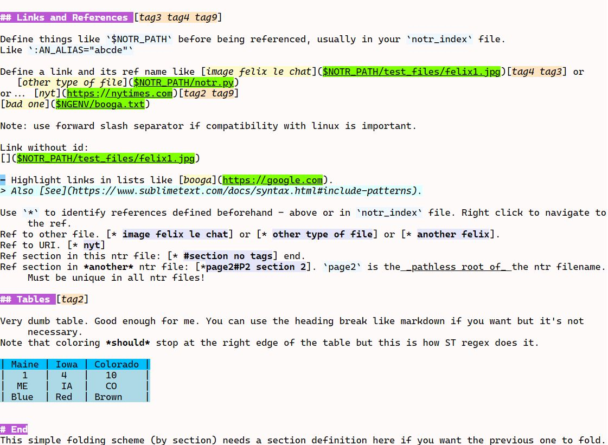

# Notr

Notr is a Sublime Text application plugin for managing and displaying collections of text notes.
It is a plain text format with some similarity to markdown. However there is no rendering-for-publication
step: the text itself is the whole point.

The markup syntax provides file and section navigation and colorizing to provide visual clues for things like
sections, links, tables, lists, etc.

Built for ST4 on Windows. Linux and OSX should be ok but are minimally tested - PRs welcome.

## Features

- Notr files have the extension `.ntr`
- Multiple notr projects.
- Sections are identified like markdown `# ## ### etc`.
- Sections with tags and simple (non-hierarchal) folding.
- Lists with several bullet types.
- Markdown-like quotes and raw text, toggle like comments.
- Tables with insert/delete column, fit, sort. Loosely based on https://github.com/wadetb/Sublime-Text-Advanced-CSV.
  This can be taken verbatim for general purpose plugin use.
- Targets and references - targets can be section, file (image or other), url.
- Navigation to targets via quick panel. Has MRU and sticky entries.
- Navigation to notr file errors.
- Search in all project notr files.
- Auto highlight - supplements [Highlight Token](https://github.com/cepthomas/SbotHighlight) (recommended).
- Render to html with [Render View](https://github.com/cepthomas/SbotRender) (recommended).

## Example

[The spec](example/notr-spec.ntr) provides an example of the features. It will look something like this:




To run the example:
- Install the plugin.
- Select `Preferences->Package Settings->Notr`.
- Add this project name to your settings (adjusted for platform):
``` json
"project_files":
[
    "<ST_PACKAGES_DIR>\\Notr\\example\\notr-demo.nproj",
]
```
- Implement color scheme per section `Color Scheme`.
- Now open `example\notr-spec.ntr`. Test drive the various context menu selections.

## Commands and Menus

| Command                      | Description                                     | Args                     |
| :--------                    | :-------                                        | :--------                |
| notr_open_project            | Open a project from settings using selector     |                          |
| notr_edit_project            | Edit the current project                        |                          |
| notr_insert_target_from_clip | Insert a target from clipboard                  |                          |
| notr_insert_ref              | Insert a ref from selector                      |                          |
| notr_goto_target             | Go to a target via selector or ref or link      | filter_by_tag=T OR F     |
| notr_goto_section            | Go to next/previous section in file             | where: next OR prev      |
| notr_insert_hrule            | Make a line                                     | fill_str="=", reps=20    |
| notr_find_in_files           | Search within the notr_paths in current project |                          |
| table_fit                    | Fit table contents to columns                   |                          |
| table_insert_col             | Insert column at caret                          |                          |
| table_delete_col             | Remove column at caret                          |                          |
| table_sort_col               | Sort column at caret - direction toggles        | asc=true OR false        |
| notr_dump                    | Diagnostic to show the internal info            |                          |
| notr_reload                  | Force reload after editing colors etc           |                          |


There is no default `Context.sublime-menu` file in this plugin.
Add the commands you like to your own `User\Context.sublime-menu` file. Typical entries are:
``` json
{ "caption": "Notr",
    "children":
    [
        { "caption": "Open Project", "command": "notr_open_project" },
        { "caption": "Edit Project", "command": "notr_edit_project" },
        { "caption": "-" },
        { "caption": "Find in Notr Files", "command": "notr_find_in_files" },
        { "caption": "Goto Target", "command": "notr_goto_target", "args" : {"filter_by_tag" : false} },
        { "caption": "Goto Target by Tag", "command": "notr_goto_target", "args" : {"filter_by_tag" : true} },
        { "caption": "Insert Target From Clipboard", "command": "notr_insert_target_from_clip" },
        { "caption": "Insert Ref", "command": "notr_insert_ref" },
        { "caption": "Insert HRule", "command": "notr_insert_hrule", "args" : {"fill_str" : "=", "reps": 60} },
        { "caption": "-" },
        { "caption": "Fit Table", "command": "table_fit" },
        { "caption": "Insert Column", "command": "table_insert_col" },
        { "caption": "Delete Column", "command": "table_delete_col" },
        { "caption": "Sort Asc", "command": "table_sort_col", "args" : {"asc" : true} },
        { "caption": "Sort Desc", "command": "table_sort_col", "args" : {"asc" : false} },
    ]
}
```

## Settings

| Setting             | Description                                   | Options         |
| :--------           | :-------                                      | :------         |
| project_files       | List of project filenames                     |                 |
| sort_tags_alpha     | Sort tags alphabetically else by frequency    | true OR false   |
| mru_size            | How many mru entries in selector              | default=5       |
| fixed_hl_whole_word | Select fixed_hl by whole word                 | true OR false   |

## Project File

A notr project file (e.g. [demo project](example/notr-demo.nproj)) contains the following elements.
Note: currently this file is pure json and doesn't support comments or trailing commas.

| Kwy                 | Description                                                     |
| :--------           | :-------                                                        |
| notr_paths          | List of where notr files live                                   |
| notr_index          | Main notr file                                                  |
| sticky              | list of section names that always appear at the top of selector |
| fixed_hl            | Three sets of user keywords                                     |
| section_sel_depth   | Selector section hierarchy depth (default=1)                    |


## Color Scheme

New scopes have been added to support this application. Adjust the values in
[notr scopes](example/notr-scopes.sublime-color-scheme) to taste and add them
to your `Packages\User\your.sublime-color-scheme` file.
Note that these are shared with the `Render View` and `Highlight Token` packages.

After editing your color-scheme, you need to close and reopen affected views.

## Caveats

- ST uses a custom line-oriented [regex engine](https://www.sublimetext.com/docs/syntax.html). Some things pertaining to normal line endings don't quite work as expected.
- Note that coloring *should* stop at the right edge of a table. This is also how ST renders MD tables. Something to do with meta-scope.
- Coloring for `markup.user_hls` and `markup.fixed_hls` only supports fore and back colors, not font_style.
- `view.add_regions()` apparently only supports colors, annotations, and icon. It does not support font style and region flags.
  Also they are not available via `extract_scope()`.
- Doesn't handle targets with embedded parentheses (i.e. C:\Program Files (x86)\SomeApp). It exceeds my meager regex skills.
- If you move or rename a `.ntr` file you need to restart Notr.

## Notes

- `sbot_common.py` contains miscellaneous common components primarily for internal use by the sbot family.
  This includes a very simple logger primarily for user-facing information, syntax errors and the like.
  Log file is in <ST_PACKAGES_DIR>\User\Notr\Notr.log.


## Future

- Publish somewhere for web access. Probably rendered html.
- Fancy stuff like image thumbnail phantom/hover, annotations, hover/popups, etc.
- Unicode picker/inserter for symbols.
