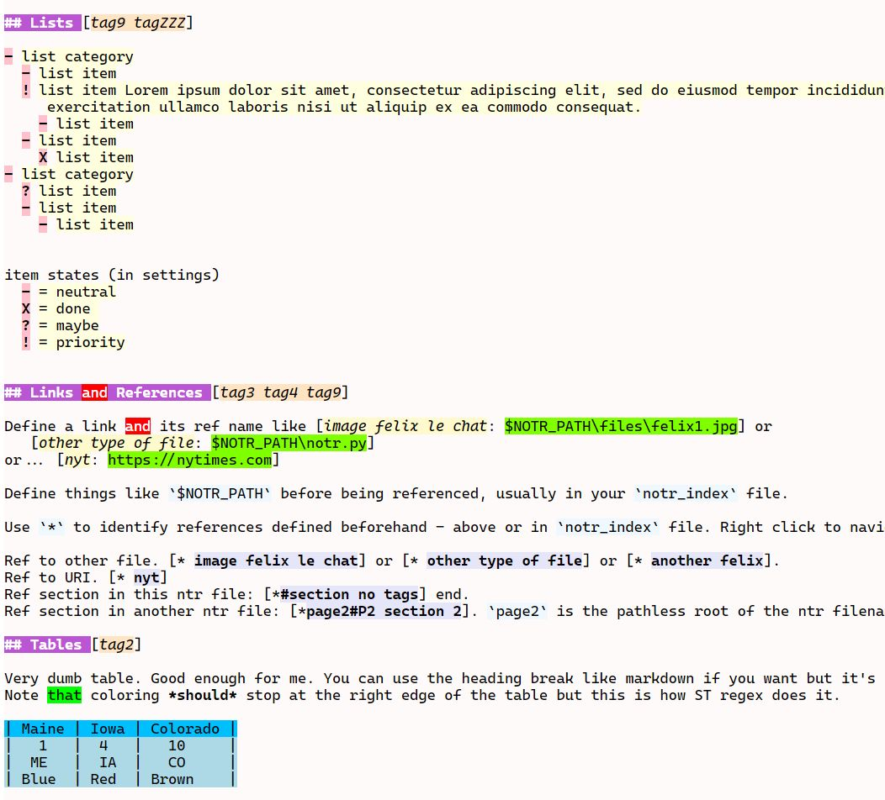

# Notr

Sublime Text markup syntax for coloring plain text files. The intention is to provide visual clues for things
like sections, links, tables, lists, etc. The syntax is somewhat similar to markdown but this is not intended
to be rendered into a pretty final form.

Built for ST4 on Windows and Linux.

## Features

- Sections with tags
- Various text decorations
- Links and references
- Lists
- Tables
- Auto highlight

- See [The spec](files/notr-spec.ntr) for an example of the features with plugin installed. Looks like this (sorry about the colors...):





## Limitations

- ST regex is a line-oriented version of [Oniguruma Regular Expressions Version 6.8.0](https://github.com/kkos/oniguruma).
  Some things pertaining to line endings don't quite work as expected.
- Note that coloring *should* stop at the right edge of a table. This is also how ST renders MD tables...
- view.add_regions() apparently only supports colors, annotations, and icon. It does not support font style and region flags.
  Also they are not available via extract_scope().

## Scopes

Notr uses these existing scopes.
```
meta.table
meta.table.header
markup.bold
markup.italic
markup.strikethrough
```

New notr-specific scopes added for this application.
```
text.notr
markup.underline.link.notr
markup.heading.notr
markup.heading.content.notr
markup.heading.marker.notr
markup.heading.tags.notr
markup.hrule.notr
markup.link.alias.notr
markup.link.name.notr
markup.link.refname.notr
markup.list.content.notr
markup.list.indent.notr
markup.list.marker.notr
markup.quote.notr
markup.raw.block.notr
markup.raw.inline.notr
```

New general scopes added (used by other sbot plugins)
```
markup.underline
markup.user_hl1
markup.user_hl2
markup.user_hl3
markup.user_hl4
markup.user_hl5
markup.user_hl6
```

files\NotrEx.sublime-color-scheme can be used as a starting point for colorizing.


## Commands

| Command                  | Implementation | Description                   | Args        |
| :--------                | :-------       | :-------                      | :--------   |
| xxx         | Context         | xxxx          |             |

## Settings

| Setting            | Description         | Options                                                               |
| :--------          | :-------            | :------                                                               |
| xxx            | xxx   | xxx   |


## Future
Things to consider.

- Support text attributes, links, refs in blocks, tables, lists, etc.
- Unicode menu/picker to insert and view at caret.
- Toggle syntax coloring (distraction free). Maybe just set to Plain Text.
- Block "comment/uncomment" useful? What would that mean - "hide" text? shade?
- File/section navigator, drag/drop/cut/copy/paste section.
- Publish notes to web for access from phone. Render html would need links.
- Tables: insert table(w, h), autofit/justify, add/delete row(s)/col(s).
- Use icons, style, annotations, phantoms? See mdpopups for generating tooltip popups.
- Show image file as phantom or hover, maybe thumbnail. See SbotDev.
- Auto/manual Indent/dedent lists with bullets. Probably not possible as ST controls this.
