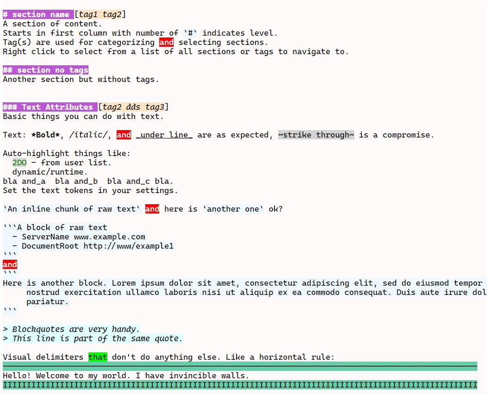

# Notr

Sublime Text markup syntax for coloring plain text files. The intention is to provide visual clues for things
like sections, links, tables, lists, etc. The syntax is somewhat similar to markdown but this is not intended
to be rendered into a pretty final form.

Built for ST4 on Windows and Linux.

## Features

- Sections with tags
- Various text decorations
- Links and references
- Lists
- Tables

- See [The spec](files/notr-spec.ntr) for an example of the features. Looks like this (sorry about the colors...):

## Limitations

- ST is line-oriented regex only.
- Note that coloring *should* stop at the right edge of a table. This is also how ST renders MD tables...
- view.add_regions() apparently only supports colors, annotations, and icon. It does not support font style and region flags.
    Also they are not available via extract_scope().
- Auto-indent with bullets? Probably not possible as ST controls this.

## Scopes

Notr uses these scopes:
- ST defaults:
  - From [Minimal Scope Coverage](https://www.sublimetext.com/docs/scope_naming.html#minimal-scope-coverage).
  - [Markup languages](https://www.sublimetext.com/docs/scope_naming.html#markup).
  - ditdit

- New scopes added for this application. Notr is a markup language but some of the default markup.* scopes
  didn't feel right.
  - From C:\Users\cepth\AppData\Roaming\Sublime Text\Packages\User\CT.sublime-color-scheme).
  - ditdit

meta. Meta scopes are used to scope larger sections of code or markup, generally containing multiple, more specific scopes. These are not intended to be styled by a color scheme, but used by preferences and plugins.

ST uses [Oniguruma Regular Expressions Version 6.8.0    2018/07/26](https://github.com/kkos/oniguruma)
Doc: https://github.com/kkos/oniguruma/blob/master/doc/RE
syntax: ONIG_SYNTAX_ONIGURUMA (default)

## Commands

| Command                    | Implementation | Description                   | Args                           |
| :--------                  | :-------       | :-------                      | :--------                      |
| notr_xxxx                  | Context        | something here                |                                |

Gotos put tags/sections on clipboard if esc.

## Settings

| Setting              | Description                              | Options                                    |
| :--------            | :-------                                 | :------                                    |
| notr_xxxx            | something here                           |                                            |

## These

- TODO1 folding by section - Default.fold.py? folding.py?

- TODO2 Expose notes to web for access from phone. Render html?

- TODO2 icons, style, annotations, phantoms - see:
    - Show image as phantom or hover. Thumbnail. See SbotDev.
    - Annotations? See anns.append()
    - see linter code to see what they do: outline
    - see Sublime Markdown Popups (mdpopups) is a library for Sublime Text plugins. for generating tooltip popups.
      It also provides API methods for generating and styling the new phantom elements
        utilizes Python Markdown with a couple of special extensions to convert Markdown to
        HTML that can be used to create the popups and/or phantoms.
        API commands to aid in creating great tooltips and phantoms.
        will use your color scheme

- TODO2 tables:
    - insert table = notr_insert_table(w, h)
    - table autofit/justify - notr_justify_table
    - table add/delete row(s)/col(s) ?

- TODO2 Block comment/uncomment useful? What would that mean - "hide" text? shade? Insert string (# or // or ...) from settings.

- TODO2 Toggle syntax coloring (distraction free). Could just set to Plain Text.

- TODO2 Fancy file.section navigator (like word-ish and/or goto anything). Drag/drop section.

## Future
Things to add later, maybe.

- Support text/link attributes in blocks, tables, lists, etc.
- Unicode menu/picker to insert, show at caret.
- Ligatures - https://practicaltypography.com/ligatures-in-programming-fonts-hell-no.html
